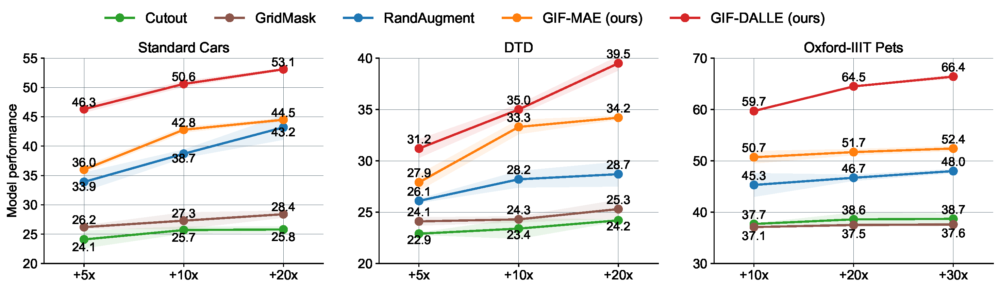
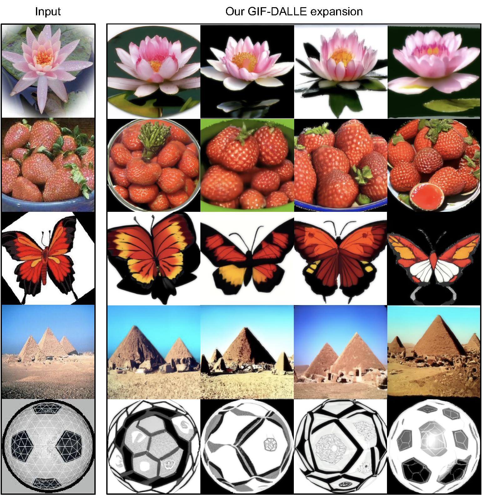
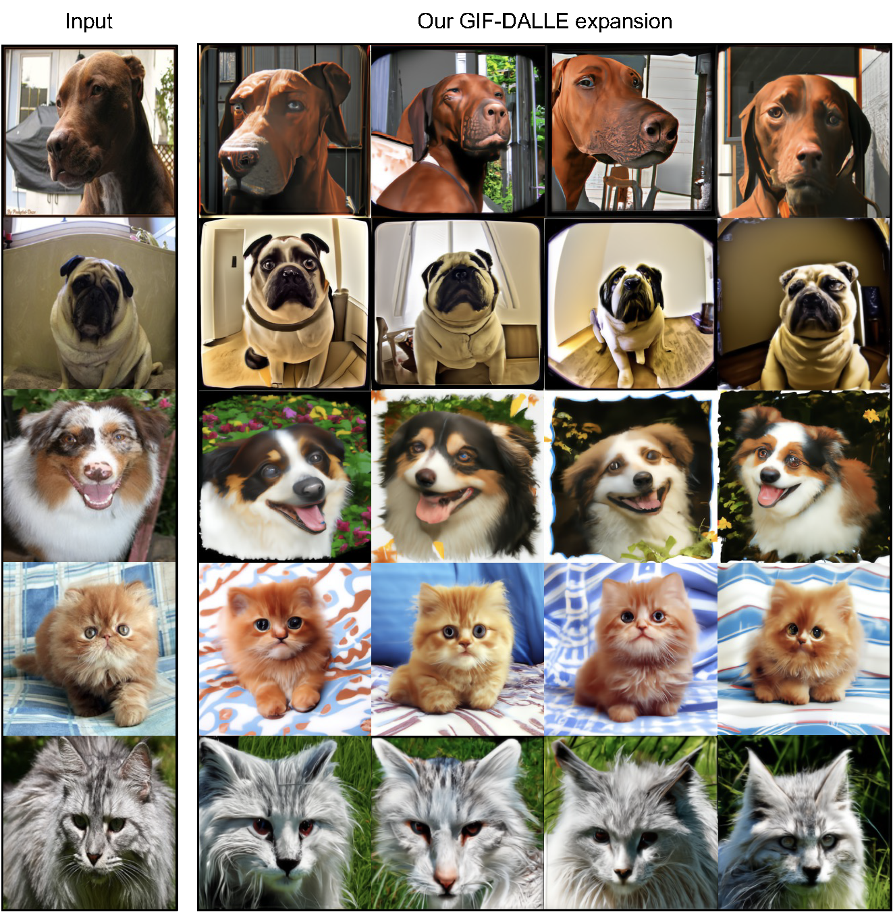

# Datasets Expansion
This is the official repository of [Expanding Small-Scale Datasets with Guided Imagination](https://arxiv.org/pdf/2211.13976.pdf).

## 1. Abstract
The power of Deep Neural Networks (DNNs) depends heavily on the training data quantity, quality and diversity. However, in many real scenarios, it is  costly and time-consuming to collect and annotate large-scale data. This has severely hindered the application of DNNs. To address this  challenge, we explore  a new task of  dataset expansion, which seeks to automatically  create new labeled samples to expand  a small dataset.  To this end,  we present  a   Guided Imagination Framework (GIF)  that leverages the recently developed big generative models (e.g., DALL-E2) and reconstruction models (e.g., MAE) to "imagine'' and   create informative new data from  seed data to expand small datasets. Specifically, GIF conducts imagination by optimizing    the latent features of  seed  data in a semantically meaningful space, which are fed into the  generative models to generate photo-realistic images with new contents. For guiding  the imagination towards  creating   samples useful for model training, we exploit the zero-shot recognition ability of   CLIP  and introduce   three   criteria to encourage informative sample generation,  i.e., prediction consistency, entropy maximization and diversity promotion.  With these essential criteria as guidance,   GIF works well for expanding  datasets in different domains,   leading to  29.9% accuracy gain on average over  six natural image datasets, and  12.3% accuracy gain on average over three medical image datasets.

## 2. Code
Source code will be released soon.

## 3. Main Results
(1) Effectiveness on six natural image datasets based on ResNet50 

|  Dataset          |  Caltech101	| Cars   |    	Flowers  |    	DTD	  |    CIFAR100-Subset  |    	Pets   | Average |
| ---------- | :---------------:| :---------------:| :---------------:| :---------------:| :---------------:| :---------------:| :---------------:| 
| Original  dataset |  26.3 | 19.8	 | 74.1 | 23.1| 	35.0	 | 6.8   | 30.9 |
| Expanded dataset by Cutout    |  51.5|  25.8	 | 77.8 | 	24.2 | 	44.3	 | 38.7   |  43.7 (+12.8) |
| Expanded dataset by GridMask    | 51.6 |  28.4	 | 80.7 | 25.3 | 	48.2	 | 37.6   |  45.3 (+14.4) |
| Expanded dataset by RandAugment    |  57.8 |  43.2	 | 83.8 | 28.7 | 	46.7	 | 48.0   | 51.4 (+20.5) |
| Expanded dataset by  GIF-MAE (ours)    |  58.4 |  44.5	 | 84.4 | 34.2 | 	52.7	 |  52.4  |  54.4 (+23.5) |
| Expanded dataset by GIF-DALLE (ours) |	63.0|	53.1	|88.2 | 39.5	|54.5|	66.4 | 60.8 (+29.9) | 

(2) Expansion efficiency based on ResNet50 

(3) Effectiveness on various network architectures based on Cars dataset

|  Dataset         |   ResNet-50 |	ResNeXt-50	| WideResNet-50	 |  MobileNet-v2	| Average   |    
|  ----------  | :---------------:|  :---------------:| :---------------:| :---------------:|  :---------------:|  
|Original dataset   | 19.8  |	18.4 	 | 32.0  |26.2 | 24.1	 |  
|Expanded  by RandAugment |	 43.2 	|  29.6	| 49.2 | 39.7|	40.4 (+9.5)	| 
|Expanded  by GIF-DALLE |	 53.1	|  43.7	| 60.0 | 47.8 |	51.2 (+27.1)	| 
 

(4) Effectiveness on three medical  image datasets based on ResNet50 

|  Dataset          |  PathMNIST |	BreastMNIST	|OrganSMNIST   | Average |
| ---------- | :---------------:| :---------------:| :---------------:| :---------------:| 
| Original  dataset | 72.4| 55.8	 | 76.3 |  68.2 |
| Expanded dataset by Cutout    | 78.8 |  66.7	 | 78.3 |  74.6 (+6.4) |
| Expanded dataset by GridMask    | 78.4 |  66.8	 | 78.9 |  74.7 (+6.5) |
| Expanded dataset by RandAugment    | 79.2 |  68.7	 | 79.6 | 75.8 (+7.6) |
| Expanded dataset by  GIF-MAE (ours)    | 82.0 |  73.3	 | 80.6 | 78.6 (+10.4) |
| Expanded dataset by GIF-DALLE (ours) |	 84.4	|  76.6	|  80.5  | 80.5 (+12.3) | 

(5) Visualization results
- Caltech101

- Cars

- Flowers

- DTD

- Pets

