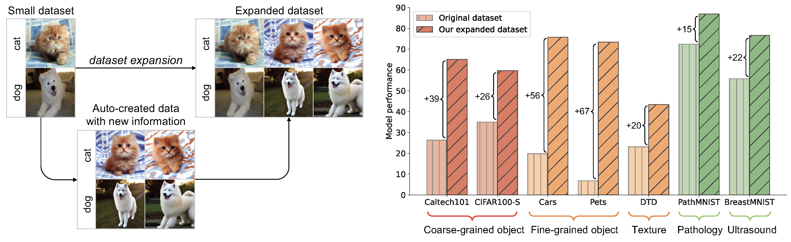
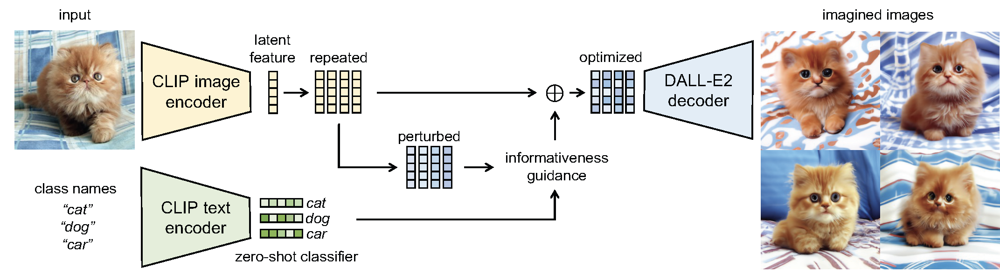

# Dataset Expansion - Guided Imagination
This is the official repository of [Expanding Small-Scale Datasets with Guided Imagination](https://arxiv.org/pdf/2211.13976.pdf)  (NeurIPS 2023).

## 1. Abstract
The power of DNNs relies heavily on the quantity and quality of training data. However, collecting and annotating data on a large scale is often expensive and time-consuming, constraining the widespread application of DNNs. To address this issue, we explore a new task, termed dataset expansion, aimed at expanding a ready-to-use small dataset by automatically creating new labeled samples. To this end, we present a Guided Imagination Framework (GIF) that leverages cutting-edge generative models like DALL-E2 and Stable Diffusion (SD) to "imagine'' and create informative new data from the input seed data. Specifically, GIF conducts data imagination by optimizing the latent features of the seed data in the semantically meaningful space of the prior model, resulting in the creation of photo-realistic images with new content. To guide the imagination towards creating informative samples for model training, we introduce two key criteria, i.e., class-maintained information boosting and sample diversity promotion. These criteria are verified to be essential for effective dataset expansion: GIF-SD obtains 13.5% higher model accuracy on natural image datasets than unguided expansion with SD. With these essential criteria, GIF successfully expands small datasets in various scenarios, boosting model accuracy by 36.9% on average over six natural image datasets and by 13.5% on average over three medical datasets. 


<p align="center">

</p>

## 2. Method Pipeline
Please refer to the [paper](https://arxiv.org/pdf/2211.13976.pdf) for more technical details.


<p align="center">

</p>

## 3. Source Code 
We provide the source code for GIF-SD below. 

### Required libraries

* Install necessary python libraries:

```
pip install opencv-python numpy scipy matplotlib pillow pandas scikit-image medmnist timm ftfy regex tqdm x-transformers fairscale transformers einops_exts accelerate torchmetrics torch-fidelity sympy transformers==4.19.2 diffusers invisible-watermark omegaconf tensorboard taming-transformers-rom1504 pytorch_lightning kornia 
```

* Install CLIP:

```
pip install git+https://github.com/openai/CLIP.git
```

* Install stable diffusion:

```
git clone https://github.com/CompVis/stable-diffusion
cd stable-diffusion
pip install -e .
cd ../
```


### Cifar100-Subset

##### (1) Prepare code and download datasets and checkpoints

* Please first copy the codes in meta file to the target file

```
cd Dataset-Expansion/GIF-SD
cp -r ./meta/* CIFAR
cd CIFAR
```

* Download datasets: 

Please download the dataset at https://drive.google.com/file/d/12Aryi3Dan8hXrw0_Kg2WU_4BIEwY4csT/view?usp=drive_link

```
unzip CIFAR_10000.zip
mv CIFAR_10000 data
```

* Download checkpoint: 

```
mkdir model
cd model
wget https://huggingface.co/CompVis/stable-diffusion-v-1-4-original/resolve/main/sd-v1-4.ckpt
mv sd-v1-4.ckpt stable_diffusion_v1-4.ckpt 
cd ../ 
```


##### (2) Dataset Expansion

* We utilize 8 distinct GPUs to execute the entire program. This is achieved by modifying `CUDA_VISIBLE_DEVICES=N` and setting `--split N` for each GPU, where *N* ranges from 0 to 7.

```
CUDA_VISIBLE_DEVICES=N python3  dataset_expansion_stable_diffusion_CLIP_batch_optimization_final.py -a  CLIP-VIT-B32   -d cifar100 --checkpoint checkpoint/cifar100/test  --data_dir data/CIFAR_10000  --data_save_dir data/CIFAR_10000_expansion/cifar100_stable_diffusion_scale50_strength0.9_CLIP_optimization_up0.8_batch_5x  --ckpt model/stable_diffusion_v1-4.ckpt  --train-batch 1 --test-batch 1   --expanded_number_per_sample 5 --expanded_batch_size 2 --scale 50 --strength 0.9 --constraint_value 0.8 --total_split 8 --split N
```

*  To be specific:

```
CUDA_VISIBLE_DEVICES=0 python3  dataset_expansion_stable_diffusion_CLIP_batch_optimization_final.py -a  CLIP-VIT-B32   -d cifar100 --checkpoint checkpoint/cifar100/test  --data_dir data/CIFAR_10000  --data_save_dir data/CIFAR_10000_expansion/cifar100_stable_diffusion_scale50_strength0.9_CLIP_optimization_up0.8_batch_5x  --ckpt model/stable_diffusion_v1-4.ckpt  --train-batch 1 --test-batch 1   --expanded_number_per_sample 5 --expanded_batch_size 2 --scale 50 --strength 0.9 --constraint_value 0.8 --total_split 8 --split 0

CUDA_VISIBLE_DEVICES=1 python3  dataset_expansion_stable_diffusion_CLIP_batch_optimization_final.py -a  CLIP-VIT-B32   -d cifar100 --checkpoint checkpoint/cifar100/test  --data_dir data/CIFAR_10000  --data_save_dir data/CIFAR_10000_expansion/cifar100_stable_diffusion_scale50_strength0.9_CLIP_optimization_up0.8_batch_5x  --ckpt model/stable_diffusion_v1-4.ckpt  --train-batch 1 --test-batch 1   --expanded_number_per_sample 5 --expanded_batch_size 2 --scale 50 --strength 0.9 --constraint_value 0.8 --total_split 8 --split 1

CUDA_VISIBLE_DEVICES=2 python3  dataset_expansion_stable_diffusion_CLIP_batch_optimization_final.py -a  CLIP-VIT-B32   -d cifar100 --checkpoint checkpoint/cifar100/test  --data_dir data/CIFAR_10000  --data_save_dir data/CIFAR_10000_expansion/cifar100_stable_diffusion_scale50_strength0.9_CLIP_optimization_up0.8_batch_5x  --ckpt model/stable_diffusion_v1-4.ckpt  --train-batch 1 --test-batch 1   --expanded_number_per_sample 5 --expanded_batch_size 2 --scale 50 --strength 0.9 --constraint_value 0.8 --total_split 8 --split 2
 
CUDA_VISIBLE_DEVICES=3 python3  dataset_expansion_stable_diffusion_CLIP_batch_optimization_final.py -a  CLIP-VIT-B32   -d cifar100 --checkpoint checkpoint/cifar100/test  --data_dir data/CIFAR_10000  --data_save_dir data/CIFAR_10000_expansion/cifar100_stable_diffusion_scale50_strength0.9_CLIP_optimization_up0.8_batch_5x  --ckpt model/stable_diffusion_v1-4.ckpt  --train-batch 1 --test-batch 1   --expanded_number_per_sample 5 --expanded_batch_size 2 --scale 50 --strength 0.9 --constraint_value 0.8 --total_split 8 --split 3

CUDA_VISIBLE_DEVICES=4 python3  dataset_expansion_stable_diffusion_CLIP_batch_optimization_final.py -a  CLIP-VIT-B32   -d cifar100 --checkpoint checkpoint/cifar100/test  --data_dir data/CIFAR_10000  --data_save_dir data/CIFAR_10000_expansion/cifar100_stable_diffusion_scale50_strength0.9_CLIP_optimization_up0.8_batch_5x  --ckpt model/stable_diffusion_v1-4.ckpt  --train-batch 1 --test-batch 1   --expanded_number_per_sample 5 --expanded_batch_size 2 --scale 50 --strength 0.9 --constraint_value 0.8 --total_split 8 --split 4 

CUDA_VISIBLE_DEVICES=5 python3  dataset_expansion_stable_diffusion_CLIP_batch_optimization_final.py -a  CLIP-VIT-B32   -d cifar100 --checkpoint checkpoint/cifar100/test  --data_dir data/CIFAR_10000  --data_save_dir data/CIFAR_10000_expansion/cifar100_stable_diffusion_scale50_strength0.9_CLIP_optimization_up0.8_batch_5x  --ckpt model/stable_diffusion_v1-4.ckpt  --train-batch 1 --test-batch 1   --expanded_number_per_sample 5 --expanded_batch_size 2 --scale 50 --strength 0.9 --constraint_value 0.8 --total_split 8 --split 5
 
CUDA_VISIBLE_DEVICES=6 python3  dataset_expansion_stable_diffusion_CLIP_batch_optimization_final.py -a  CLIP-VIT-B32   -d cifar100 --checkpoint checkpoint/cifar100/test  --data_dir data/CIFAR_10000  --data_save_dir data/CIFAR_10000_expansion/cifar100_stable_diffusion_scale50_strength0.9_CLIP_optimization_up0.8_batch_5x  --ckpt model/stable_diffusion_v1-4.ckpt  --train-batch 1 --test-batch 1   --expanded_number_per_sample 5 --expanded_batch_size 2 --scale 50 --strength 0.9 --constraint_value 0.8 --total_split 8 --split 6 

CUDA_VISIBLE_DEVICES=7 python3  dataset_expansion_stable_diffusion_CLIP_batch_optimization_final.py -a  CLIP-VIT-B32   -d cifar100 --checkpoint checkpoint/cifar100/test  --data_dir data/CIFAR_10000  --data_save_dir data/CIFAR_10000_expansion/cifar100_stable_diffusion_scale50_strength0.9_CLIP_optimization_up0.8_batch_5x  --ckpt model/stable_diffusion_v1-4.ckpt  --train-batch 1 --test-batch 1   --expanded_number_per_sample 5 --expanded_batch_size 2 --scale 50 --strength 0.9 --constraint_value 0.8 --total_split 8 --split 7
```

* Please note that if your system doesn't possess 8 GPUs, you can modify the `total_split` parameter in the code to reflect the actual number of GPUs you have, and make corresponding adjustments to the `split` value.


##### (3) Model training

*  Training with original dataset:

```
python3 cifar.py -a resnet50  --gpu 0 -d cifar100  --data_dir data/CIFAR_10000 --checkpoint checkpoint/cifar100/resnet_lr0.1_r0 --lr 0.1 --train-batch 256   --test-batch 100 --epoch 100
```

* Training with the expanded dataset:

```
python3 cifar_expanded_data_concat_original.py -a resnet50 --gpu 0,1 -d cifar100 --checkpoint checkpoint/cifar100/RN50_unpretrained_stable_diffusion_scale50_strength0.9_CLIP_optimization_up0.8_batch_5x_e100_r0 --data_dir data/CIFAR_10000  --data_expanded_dir   data/CIFAR_10000_expansion/cifar100_stable_diffusion_scale50_strength0.9_CLIP_optimization_up0.8_batch_5x --train-batch 256  --test-batch 100 --epochs 100       
```


### Caltech101

##### (1) Prepare code and download datasets and checkpoints

* Please first copy the codes in meta file to the target file

```
cd Dataset-Expansion/GIF-SD
cp -r ./meta/* Caltech
cd Caltech
```

* Download datasets: 

Please download the Caltech101 dataset at https://drive.google.com/file/d/1oqrf9-UmKaOBkK86c-0OAxLwkPNlCPWg/view?usp=sharing

```
Please unzip it and name it as caltech101
mv caltech101 data
```

* Download checkpoint: 

```
mkdir model
cd model
wget https://huggingface.co/CompVis/stable-diffusion-v-1-4-original/resolve/main/sd-v1-4.ckpt
mv sd-v1-4.ckpt stable_diffusion_v1-4.ckpt 
cd ../
```


##### (2) Dataset Expansion

* We utilize 8 distinct GPUs to execute the entire program. This is achieved by modifying `CUDA_VISIBLE_DEVICES=N` and setting `--split N` for each GPU, where *N* ranges from 0 to 7.

```
CUDA_VISIBLE_DEVICES=N python3  dataset_expansion_stable_diffusion_CLIP_batch_optimization.py -a  CLIP-VIT-B32   -d caltech101 --checkpoint checkpoint/caltech101/test  --data_dir data/caltech101  --data_save_dir data/caltech101_expansion/caltech101_stable_diffusion_scale5_strength0.9_CLIP_optimization_up4_5x  --ckpt model/stable_diffusion_v1-4.ckpt  --train-batch 1 --test-batch 1   --expanded_number_per_sample 5 --expanded_batch_size 2 --scale 5 --strength 0.9 --constraint_value 4 --total_split 8 --split N
```

* Please note that if your system doesn't possess 8 GPUs, you can modify the `total_split` parameter in the code to reflect the actual number of GPUs you have, and make corresponding adjustments to the `split` value.


##### (3) Model training

*  Training with original dataset:

```
python3 caltech.py -a resnet50 --gpu 0 -d caltech101 --data_dir data/caltech101   --checkpoint checkpoint/caltech101/RN50_unpretrained_lr0.1_e100_r0 --train-batch 256  --test-batch 100 --epochs 100 --lr 0.01
```

* Training with the expanded dataset:

```
python3 caltech_expanded_data_concat_original.py -a resnet50 --gpu 0,1 -d caltech101 --checkpoint checkpoint/caltech101/RN50_unpretrained_stable_diffusion_scale5_strength0.9_CLIP_optimization_up4_5x_lr0.01_e100_r3 --data_dir data/caltech101  --data_expanded_dir   data/caltech101_expansion/caltech101_stable_diffusion_scale5_strength0.9_CLIP_optimization_up4_5x --train-batch 256  --test-batch 100 --epochs 100 --lr 0.01     
```


### Cars

##### (1) Prepare code and download datasets and checkpoints

* Please first copy the codes in meta file to the target file

```
cd Dataset-Expansion/GIF-SD
cp -r ./meta/* Cars
cd Cars
```

* Download datasets: 

Please download the dataset at https://www.kaggle.com/datasets/jessicali9530/stanford-cars-dataset

```
Please unzip it and name it as car
mv car data
```

* Download checkpoint: 

```
mkdir model
cd model
wget https://huggingface.co/CompVis/stable-diffusion-v-1-4-original/resolve/main/sd-v1-4.ckpt
mv sd-v1-4.ckpt stable_diffusion_v1-4.ckpt 
cd ../
```


##### (2) Dataset Expansion

* We utilize 8 distinct GPUs to execute the entire program. This is achieved by modifying `CUDA_VISIBLE_DEVICES=N` and setting `--split N` for each GPU, where *N* ranges from 0 to 7.

```
CUDA_VISIBLE_DEVICES=N python3  dataset_expansion_stable_diffusion_CLIP_batch_optimization.py -a  CLIP-VIT-B32   -d car --checkpoint checkpoint/car/test  --data_dir data/car  --data_save_dir data/car_expansion/car_stable_diffusion_scale50_strength0.9_CLIP_optimization_up0.8_5x  --ckpt model/stable_diffusion_v1-4.ckpt  --train-batch 1 --test-batch 1   --expanded_number_per_sample 5 --expanded_batch_size 2 --scale 50 --strength 0.9 --constraint_value 0.8 --total_split 8 --split N
```

* Please note that if your system doesn't possess 8 GPUs, you can modify the `total_split` parameter in the code to reflect the actual number of GPUs you have, and make corresponding adjustments to the `split` value.


##### (3) Model training

*  Training with original dataset:

```
python3 car.py -a resnet50 --gpu 0 -d car --data_dir data/car   --checkpoint checkpoint/car/RN50_unpretrained_lr0.01_e100_r0 --train-batch 256  --test-batch 100 --epochs 100 --lr 0.01

```

* Training with the expanded dataset:

```
python3 car_expanded_data_concat_original.py -a resnet50 --gpu 0,1 -d car --checkpoint checkpoint/car/RN50_unpretrained_stable_diffusion_scale50_strength0.9_CLIP_5x_lr0.01_e100_r0  --data_dir data/car  --data_expanded_dir  data/car_expansion/car_stable_diffusion_scale50_strength0.9_CLIP_optimization_up0.8_5x  --train-batch 256  --test-batch 100 --epochs 100 --lr 0.01  
```


### DTD

##### (1) Prepare code and download datasets and checkpoints

* Please first copy the codes in meta file to the target file

```
cd Dataset-Expansion/GIF-SD
cp -r ./meta/* dtd
cd dtd
```

* Download datasets: 

Please download the dataset at https://www.robots.ox.ac.uk/~vgg/data/dtd

```
Please unzip it and name it as dtd
mv dtd data
```

* Download checkpoint: 

```
mkdir model
cd model
wget https://huggingface.co/CompVis/stable-diffusion-v-1-4-original/resolve/main/sd-v1-4.ckpt
mv sd-v1-4.ckpt stable_diffusion_v1-4.ckpt 
cd ../
```


##### (2) Dataset Expansion

* We utilize 8 distinct GPUs to execute the entire program. This is achieved by modifying `CUDA_VISIBLE_DEVICES=N` and setting `--split N` for each GPU, where *N* ranges from 0 to 7.

```
CUDA_VISIBLE_DEVICES=N python3  dataset_expansion_stable_diffusion_CLIP_batch_optimization.py -a  CLIP-VIT-B32   -d dtd --checkpoint checkpoint/dtd/test  --data_dir data/dtd  --data_save_dir data/dtd_expansion/dtd_stable_diffusion_scale50_strength0.5_CLIP_optimization_up0.8_5x  --ckpt model/stable_diffusion_v1-4.ckpt  --train-batch 1 --test-batch 1   --expanded_number_per_sample 5 --expanded_batch_size 2 --scale 50 --strength 0.5 --constraint_value 0.8 --total_split 8 --split N
```

* Please note that if your system doesn't possess 8 GPUs, you can modify the `total_split` parameter in the code to reflect the actual number of GPUs you have, and make corresponding adjustments to the `split` value.

 

##### (3) Model training

*  Training with original dataset:

```
python3 dtd.py -a resnet50 --gpu 0 -d dtd --data_dir data/dtd   --checkpoint checkpoint/dtd/RN50_unpretrained_lr0.01_e100_r0 --train-batch 256  --test-batch 100 --epochs 100 --lr 0.01

```

* Training with the expanded dataset:

```
python3 dtd_expanded_data_concat_original.py -a resnet50 --gpu 0,1 -d car --checkpoint checkpoint/dtd/RN50_unpretrained_stable_diffusion_scale50_strength0.5_CLIP_optimization_up0.8_5x_lr0.01_e100_r0 --data_dir data/dtd  --data_expanded_dir   data/dtd_expansion/dtd_stable_diffusion_scale50_strength0.5_CLIP_optimization_up0.8_5x   --train-batch 256  --test-batch 100 --epochs 100 --lr 0.01
```


### Flowers

##### (1) Prepare code and download datasets and checkpoints

* Please first copy the codes in meta file to the target file

```
cd Dataset-Expansion/GIF-SD
cp -r ./meta/* flowers
cd flowers
```

* Download datasets: 

Please download the dataset at https://www.kaggle.com/c/oxford-102-flower-pytorch/data

```
Please unzip it and name it as flowers
mv flowers data
```

* Download checkpoint: 

```
mkdir model
cd model
wget https://huggingface.co/CompVis/stable-diffusion-v-1-4-original/resolve/main/sd-v1-4.ckpt
mv sd-v1-4.ckpt stable_diffusion_v1-4.ckpt 
cd ../ 
```


##### (2) Dataset Expansion

* We utilize 8 distinct GPUs to execute the entire program. This is achieved by modifying `CUDA_VISIBLE_DEVICES=N` and setting `--split N` for each GPU, where *N* ranges from 0 to 7.

```
CUDA_VISIBLE_DEVICES=N python3  dataset_expansion_stable_diffusion_CLIP_batch_optimization.py -a  CLIP-VIT-B32   -d flowers --checkpoint checkpoint/flowers/test  --data_dir data/flowers  --data_save_dir data/flowers_expansion/flowers_stable_diffusion_scale8_strength0.5_CLIP_optimization_up0.8_5x  --ckpt model/stable_diffusion_v1-4.ckpt  --train-batch 1 --test-batch 1   --expanded_number_per_sample 5 --expanded_batch_size 2 --scale 8 --strength 0.5 --constraint_value 0.8 --total_split 8 --split N
```

* Please note that if your system doesn't possess 8 GPUs, you can modify the `total_split` parameter in the code to reflect the actual number of GPUs you have, and make corresponding adjustments to the `split` value.


##### (3) Model training

*  Training with original dataset:

```
python3 flowers.py -a resnet50 --gpu 0 -d flowers --data_dir data/flowers   --checkpoint checkpoint/flowers/RN50_unpretrained_lr0.1_e100_r0 --train-batch 256  --test-batch 100 --epochs 100 --lr 0.1
```

* Training with the expanded dataset:

```
python3 flowers_expanded_data_concat_original.py -a resnet50 --gpu 0,1 -d car --checkpoint checkpoint/flowers/RN50_unpretrained_stable_diffusion_scale8_strength0.5_CLIP_optimization_up0.8_5x_lr0.01_e100_r0 --data_dir data/flowers  --data_expanded_dir   data/flowers_expansion/flowers_stable_diffusion_scale8_strength0.5_CLIP_optimization_up0.8_5x  --train-batch 256  --test-batch 100 --epochs 100 --lr 0.1
```

 

### Pets

##### (1) Prepare code and download datasets and checkpoints

* Please first copy the codes in meta file to the target file

```
cd Dataset-Expansion/GIF-SD
cp -r ./meta/* Pets
cd Pets
```

* Download datasets: 

Please download the dataset at https://www.robots.ox.ac.uk/~vgg/data/pets

```
Please unzip it and name it as pets
mv pets data
```

* Download checkpoint: 

```
mkdir model
cd model
wget https://huggingface.co/CompVis/stable-diffusion-v-1-4-original/resolve/main/sd-v1-4.ckpt
mv sd-v1-4.ckpt stable_diffusion_v1-4.ckpt 
cd ../ 
```


##### (2) Dataset Expansion

* We utilize 8 distinct GPUs to execute the entire program. This is achieved by modifying `CUDA_VISIBLE_DEVICES=N` and setting `--split N` for each GPU, where *N* ranges from 0 to 7.

```
CUDA_VISIBLE_DEVICES=N python3  dataset_expansion_stable_diffusion_CLIP_batch_optimization.py -a  CLIP-VIT-B32   -d pets --checkpoint checkpoint/pets/test  --data_dir data/pets  --data_save_dir data/pets_expansion/pets_stable_diffusion_scale50_strength0.7_CLIP_optimization_up0.8_10x  --ckpt model/stable_diffusion_v1-4.ckpt  --train-batch 1 --test-batch 1   --expanded_number_per_sample 10 --expanded_batch_size 2 --scale 50 --strength 0.7 --constraint_value 0.8 --total_split 8 --split N
```

* Please note that if your system doesn't possess 8 GPUs, you can modify the `total_split` parameter in the code to reflect the actual number of GPUs you have, and make corresponding adjustments to the `split` value.


##### (3) Model training

*  Training with original dataset:

```
python3 pets.py -a resnet50 --gpu 0 -d pets --data_dir data/pets   --checkpoint checkpoint/pets/RN50_unpretrained_lr0.01_e100_r0 --train-batch 256  --test-batch 100 --epochs 100 --lr 0.01 
```

* Training with the expanded dataset:

```
python3 pets_expanded_data_concat_original.py -a resnet50 --gpu 0,1 -d pets --checkpoint checkpoint/pets/RN50_unpretrained_stable_diffusion_scale50_strength0.7_CLIP_optimization_up0.8_10x_lr0.01_e100_r0 --data_dir data/pets  --data_expanded_dir  data/pets_expansion/pets_stable_diffusion_scale50_strength0.7_CLIP_optimization_up0.8_10x  --train-batch 256  --test-batch 100 --epochs 100 --lr 0.01 
```


### OrganSMNIST

##### (1) Prepare code and download datasets and checkpoints

* Please first copy the codes in meta file to the target file

```
cd Dataset-Expansion/GIF-SD
cp -r ./meta/* organsmnist
cd organsmnist
```

* Download datasets: 

Please download the dataset according to https://medmnist.com/

```
Please unzip it and name it as ori_organsmnist
mv ori_organsmnist data
```

* Download checkpoint: 

```
mkdir model
cd model
wget https://huggingface.co/CompVis/stable-diffusion-v-1-4-original/resolve/main/sd-v1-4.ckpt
mv sd-v1-4.ckpt stable_diffusion_v1-4.ckpt 
cd ../ 
```

* SD Model fine-tuning with DreamBooth: 

Please fine-tune the original stable diffusion based on https://github.com/XavierXiao/Dreambooth-Stable-Diffusion

Download the code, and run the provided launch script:

```
cd dreambooth_organsmnist
bash organsmnist_launch.sh 
```

Please name the checkpoint as organsmnist_tuned_sd.ckpt


##### (2) Dataset Expansion

* We utilize 8 distinct GPUs to execute the entire program. This is achieved by modifying `CUDA_VISIBLE_DEVICES=N` and setting `--split N` for each GPU, where *N* ranges from 0 to 7.

```
CUDA_VISIBLE_DEVICES=N python3  dataset_expansion_stable_diffusion_CLIP_batch_optimization.py -a  CLIP-VIT-B32   -d organsmnist --checkpoint checkpoint/organsmnist/test  --data_dir data/ori_organsmnist  --data_save_dir data/organsmnist_expansion/organsmnist_stable_diffusion_scale5_strength0.4_up0.5_5x   --ckpt model/organsmnist_tuned_sd.ckpt    --train-batch 1 --test-batch 1   --expanded_number_per_sample 5  --expanded_batch_size 2 --scale 5 --strength 0.4 --constraint_value 0.5  --total_split 8 --split N
```

* Please note that if your system doesn't possess 8 GPUs, you can modify the `total_split` parameter in the code to reflect the actual number of GPUs you have, and make corresponding adjustments to the `split` value.


##### (3) Model training

*  Training with original dataset:

```
python3 organsmnist.py -a resnet50 --gpu 0 -d organsmnist --checkpoint checkpoint/organsmnist/RN50_unpretrained_lr0.1_e100_r0 --train-batch 256  --test-batch 100 --epochs 100 --lr 0.1
```

* Training with the expanded dataset:

```
python3 organsmnist_expanded_data_concat.py -a resnet50 --gpu 0,1  -d organsmnist --checkpoint checkpoint/organsmnist/RN50_unpretrained_organsmnist_stable_diffusion_scale5_strength0.4_up0.5_5x_e100_r0 --data_dir data/ori_organsmnist --data_expanded_dir data/organsmnist_expansion/organsmnist_stable_diffusion_scale5_strength0.4_up0.5_5x  --train-batch 256  --test-batch 100 --epochs 100  --lr 0.1
```


### PathMNIST

##### (1) Prepare code and download datasets and checkpoints

* Please first copy the codes in meta file to the target file

```
cd Dataset-Expansion/GIF-SD
cp -r ./meta/* pathmnist
cd pathmnist
```

* Download datasets: 

Please download the dataset according to https://medmnist.com/

```
Please unzip it and name it as pathmnist
mv pathmnist data
```

* Download checkpoint: 

```
mkdir model
cd model
wget https://huggingface.co/CompVis/stable-diffusion-v-1-4-original/resolve/main/sd-v1-4.ckpt
mv sd-v1-4.ckpt stable_diffusion_v1-4.ckpt 
cd ../ 
```

* SD Model fine-tuning with DreamBooth: 

Please fine-tune the original stable diffusion based on https://github.com/XavierXiao/Dreambooth-Stable-Diffusion

Download the code, and run the provided launch script:

```
cd dreambooth_pathmnist
bash pathmnist_launch.sh 
```

Please name the checkpoint as pathmnist_tuned_sd.ckpt


##### (2) Dataset Expansion

* We utilize 8 distinct GPUs to execute the entire program. This is achieved by modifying `CUDA_VISIBLE_DEVICES=N` and setting `--split N` for each GPU, where *N* ranges from 0 to 7.

```
CUDA_VISIBLE_DEVICES=N python3  dataset_expansion_stable_diffusion_CLIP_batch_optimization.py -a  CLIP-VIT-B32   -d pathmnist --checkpoint checkpoint/pathmnist/test  --data_dir data/pathmnist  --data_save_dir data/pathmnist_expansion/pathmnist_stable_diffusion_scale5_strength0.9_up0.1_5x   --ckpt model/pathmnist_tuned_sd.ckpt    --train-batch 1 --test-batch 1   --expanded_number_per_sample 5  --expanded_batch_size 2 --scale 5 --strength 0.9 --constraint_value 0.1  --total_split 8 --split N
```

* Please note that if your system doesn't possess 8 GPUs, you can modify the `total_split` parameter in the code to reflect the actual number of GPUs you have, and make corresponding adjustments to the `split` value.


##### (3) Model training

*  Training with original dataset:

```
python3 pathmnist.py -a resnet50 --gpu 0 -d pathmnist --data_dir data/pathmnist  --checkpoint checkpoint/pathmnist/RN50_unpretrained_lr0.01_e100_r0 --train-batch 256  --test-batch 100 --epochs 100 --lr 0.01 
```

* Training with the expanded dataset:

```
python3 pathmnist_expanded_data_concat.py -a resnet50 --gpu 0,1 -d pathmnist --checkpoint checkpoint/pathmnist/RN50_unpretrained_pathmnist_tuned_stable_diffusion_scale5_strength0.9_up0.1_5x_lr0.01_e100_r0 --data_dir data/pathmnist --data_expanded_dir data/pathmnist_expansion/pathmnist_stable_diffusion_scale5_strength0.9_up0.1_5x  --train-batch 256  --test-batch 100 --epochs 100  --lr 0.01 
```


### BreastMNIST

##### (1) Prepare code and download datasets and checkpoints

* Please first copy the codes in meta file to the target file

```
cd Dataset-Expansion/GIF-SD
cp -r ./meta/* breastmnist
cd breastmnist
```

* Download datasets: 

Please download the dataset according to https://medmnist.com/

```
Please unzip it and name it as breastmnist
mv breastmnist data
```

* Download checkpoint: 

```
mkdir model
cd model
wget https://huggingface.co/CompVis/stable-diffusion-v-1-4-original/resolve/main/sd-v1-4.ckpt
mv sd-v1-4.ckpt stable_diffusion_v1-4.ckpt 
cd ../ 
```

* SD Model fine-tuning with DreamBooth: 

Please fine-tune the original stable diffusion based on https://github.com/XavierXiao/Dreambooth-Stable-Diffusion

Download the code, and run the provided launch script:

```
cd dreambooth_breastmnist
bash breastmnist_launch.sh 
```

Please name the checkpoint as breastmnist_tuned_sd.ckpt


##### (2) Dataset Expansion

* We utilize 8 distinct GPUs to execute the entire program. This is achieved by modifying `CUDA_VISIBLE_DEVICES=N` and setting `--split N` for each GPU, where *N* ranges from 0 to 7.

```
CUDA_VISIBLE_DEVICES=N python3  dataset_expansion_stable_diffusion_CLIP_batch_optimization.py -a  CLIP-VIT-B32   -d breastmnist --checkpoint checkpoint/breastmnist/test  --data_dir data/breastmnist  --data_save_dir data/breastmnist_expansion/breastmnist_stable_diffusion_scale5_strength0.9_up0.1_5x   --ckpt model/breastmnist_tuned_sd.ckpt    --train-batch 1 --test-batch 1   --expanded_number_per_sample 5  --expanded_batch_size 2 --scale 5 --strength 0.9 --constraint_value 0.1 --total_split 8 --split N
```

* Please note that if your system doesn't possess 8 GPUs, you can modify the `total_split` parameter in the code to reflect the actual number of GPUs you have, and make corresponding adjustments to the `split` value.

 

##### (3) Model training

*  Training with original dataset:

```
python3 breastmnist.py -a resnet50 --gpu 0 -d breastmnist --data_dir data/breastmnist  --checkpoint checkpoint/breastmnist/RN50_unpretrained_lr0.01_e100_r0 --train-batch 256  --test-batch 100 --epochs 100 --lr 0.01
```

* Training with the expanded dataset:

```
python3 breastmnist_expanded_data_concat.py -a resnet50 --gpu 0 -d breastmnist --checkpoint checkpoint/breastmnist/RN50_unpretrained_stable_diffusion_scale5_strength0.9_up0.1_5x_e100_r0  --data_dir data/breastmnist --data_expanded_dir data/breastmnist_expansion/breastmnist_stable_diffusion_scale5_strength0.9_up0.1_5x  --train-batch 256  --test-batch 100 --epochs 100  --lr 0.01  
```


## 4. Citation

If you find our work inspiring in your research, please cite our work.

```
@inproceedings{zhang2023expanding,
  title={Expanding Small-Scale Datasets with Guided Imagination},
  author={Zhang, Yifan and Zhou, Daquan and Hooi, Bryan and Wang, Kai and Feng, Jiashi},
  booktitle={Advances in Neural Information Processing Systems},
  year={2023}
}
```
